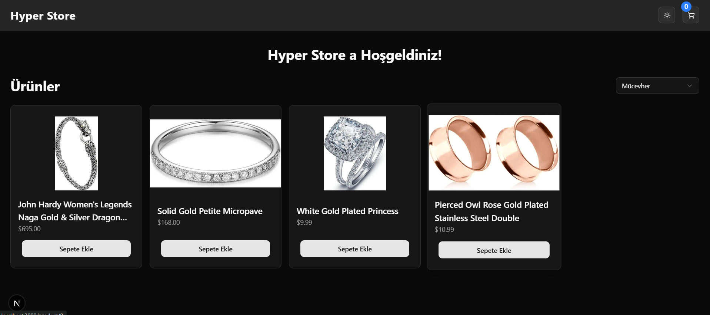
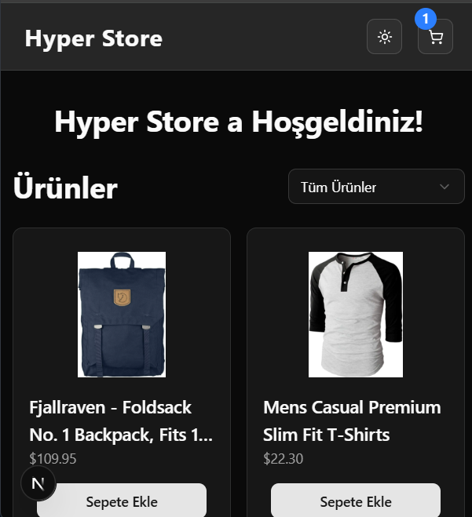
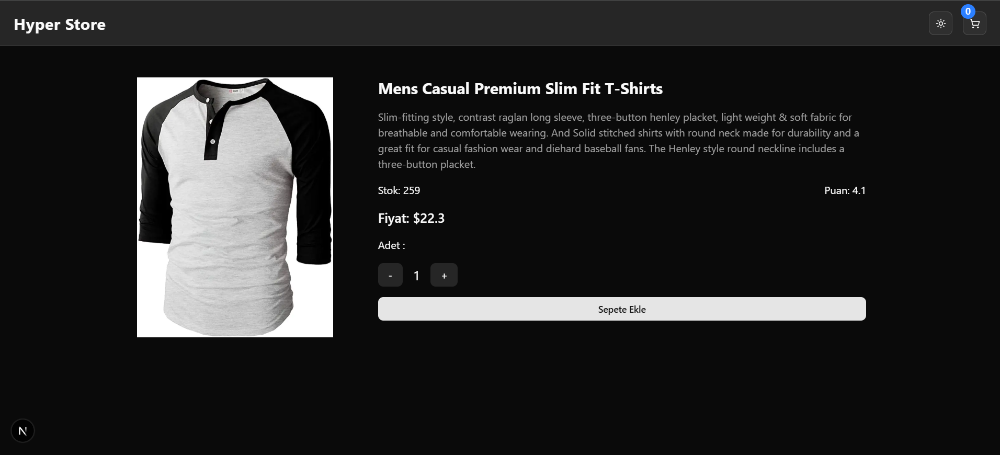
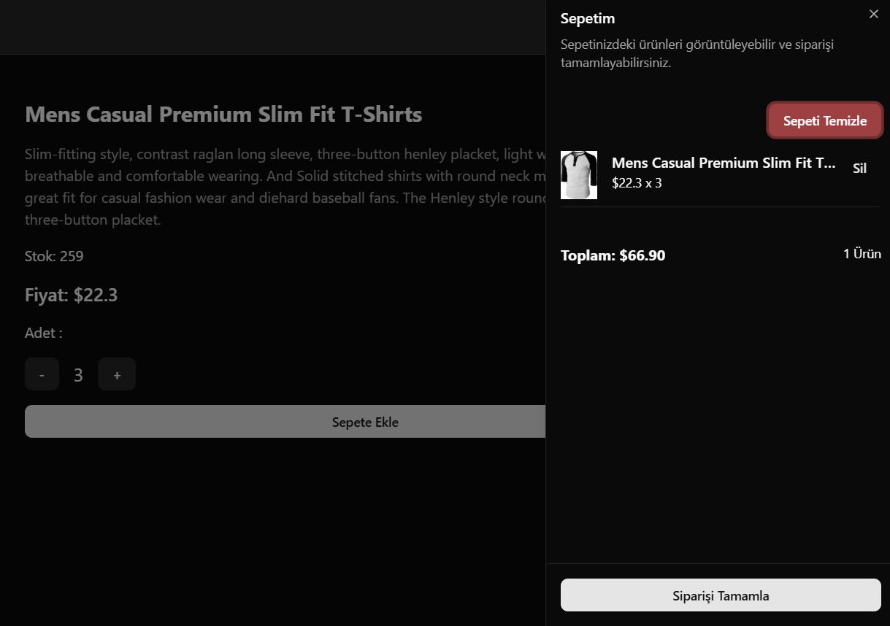
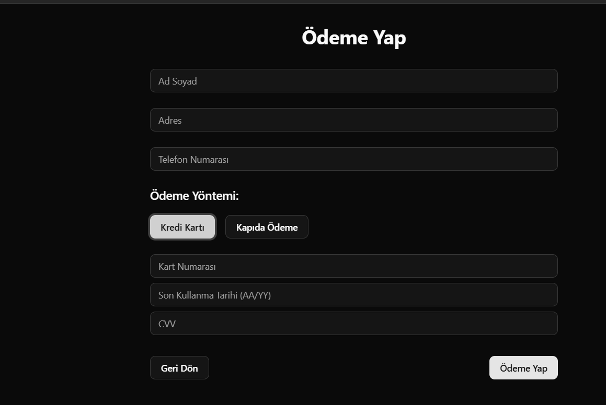

# 🛍️ Hyper Store

React, Next.js ve modern UI bileşenleri kullanılarak geliştirilen, kullanıcı dostu ve SEO uyumlu bir e-ticaret uygulaması.

## 🚀 Proje Hakkında

Bu proje, [FakeStore API](https://fakestoreapi.com/docs) kullanılarak ürün listeleme, sepet yönetimi ve ödeme işlemlerini kapsayan bir e-ticaret uygulamasıdır.

## 🌐 Canlı Demo

[Hyper Store - Canlı Görüntüle](https://hyperstore.vercel.app)

## 📚 Teknolojiler

- Next.js (App Router)
- React & Redux Toolkit
- Tailwind CSS
- Shadcn/UI
- FakeStore API

### 🔥 Özellikler

- **Ürün Listeleme**: API'den çekilen ürünler ana sayfada listelenir. Kategoriye göre filtreleme yapılabilir. Her ürün için görsel, başlık, fiyat ve "Sepete Ekle" butonu bulunur.
- **Ürün Detayı**: Ürün kartına tıklanarak detay sayfasına gidilir. Detay sayfasında ürünün açıklaması, fiyatı ve adet seçimi yapılarak sepete ekleme işlemi yapılabilir.
- **Sepet Yönetimi**: Sepete eklenen ürünler Sheet (yan panel) bileşeniyle her sayfada görüntülenebilir. Kullanıcı ürünleri silebilir veya tüm sepeti temizleyebilir.
- **Checkout ve Ödeme Süreci**:
  - Sepetteki ürünler checkout sayfasında listelenir.
  - Kullanıcılar kredi kartı veya kapıda ödeme seçeneğiyle ödeme yapabilir.
  - Kredi kartı seçildiğinde, sahte bir SMS doğrulama kodu gönderilir. Doğru kod girildiğinde "Sipariş alındı" bildirimi gösterilir.
- **Durum Yönetimi**: Sepet ve ödeme süreci Redux Toolkit kullanılarak yönetilir. Sepet verileri `localStorage` kullanılarak kalıcı hale getirilir.
- **Tema Desteği**: Açık/Koyu tema geçişi yapılabilir.
- **Lazy Loading & Code Splitting**: Suspense ve React.lazy() kullanılarak bileşenler dinamik olarak yüklenir. Ayrıca, hata yönetimi için özel NotFound ve Error sayfaları tasarlandı.
- **SEO Optimizasyonu**: Sayfalara özel meta etiketleri eklenmiştir.
- **Responsive Tasarım**: Tüm cihazlarda uyumlu olacak şekilde `Tailwind CSS` kullanılarak tasarlandı.

## 📸 Proje Görselleri







## 📦 Kurulum ve Çalıştırma

Projeyi yerel ortamınıza kurmak ve çalıştırmak için aşağıdaki adımları izleyin:

```bash
# Depoyu klonla
git clone https://github.com/bayramenesyilmaz/hyperstore.git
cd hyperstore

# Bağımlılıkları yükle
npm install

# Geliştirme sunucusunu başlat
npm run dev
```

Tarayıcınızda [http://localhost:3000](http://localhost:3000) adresini ziyaret ederek projeyi görüntüleyebilirsiniz.
